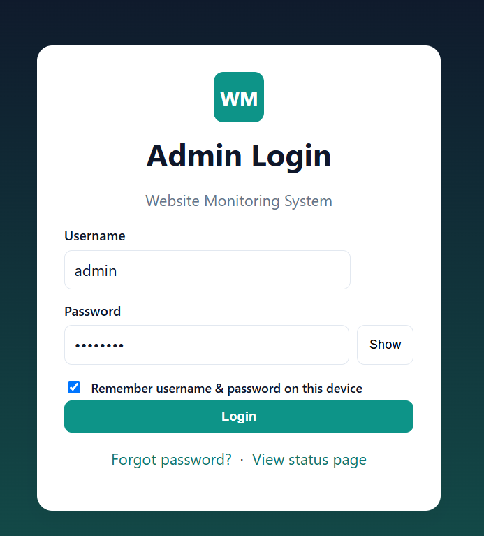
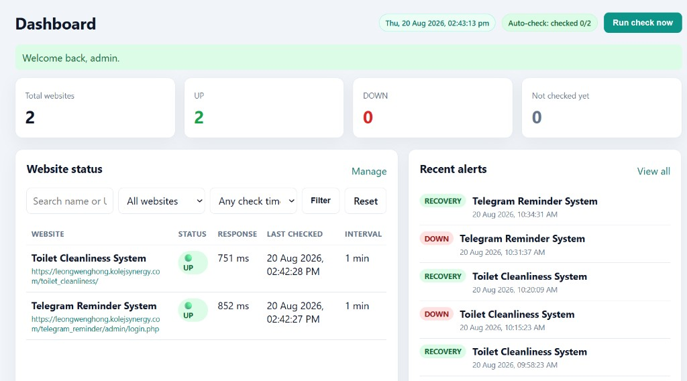
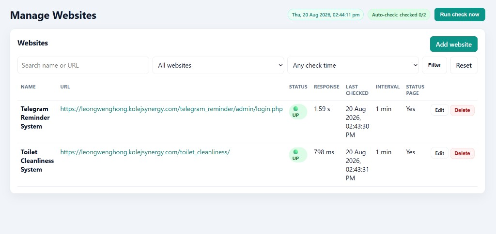
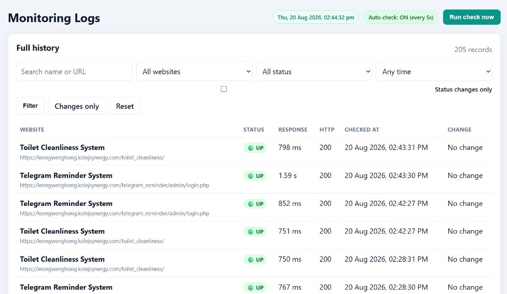
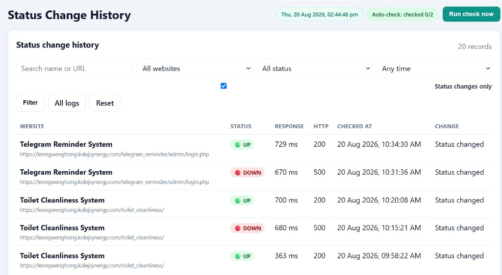
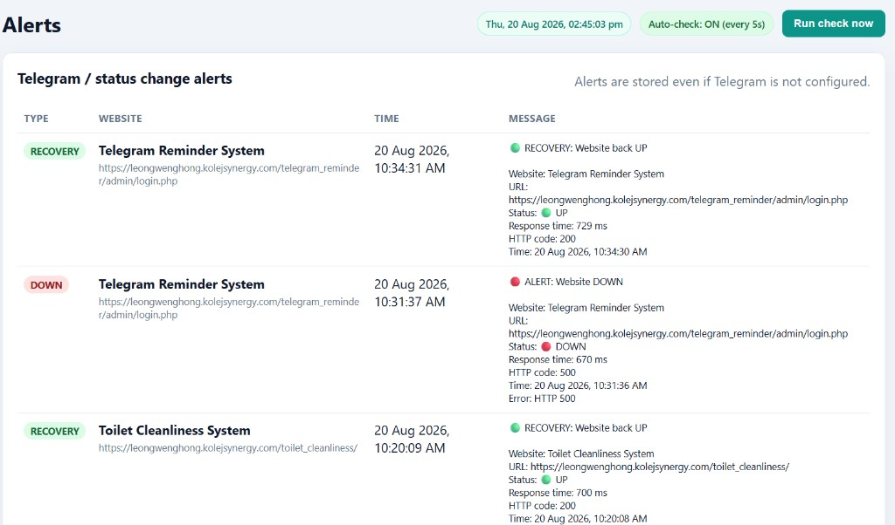
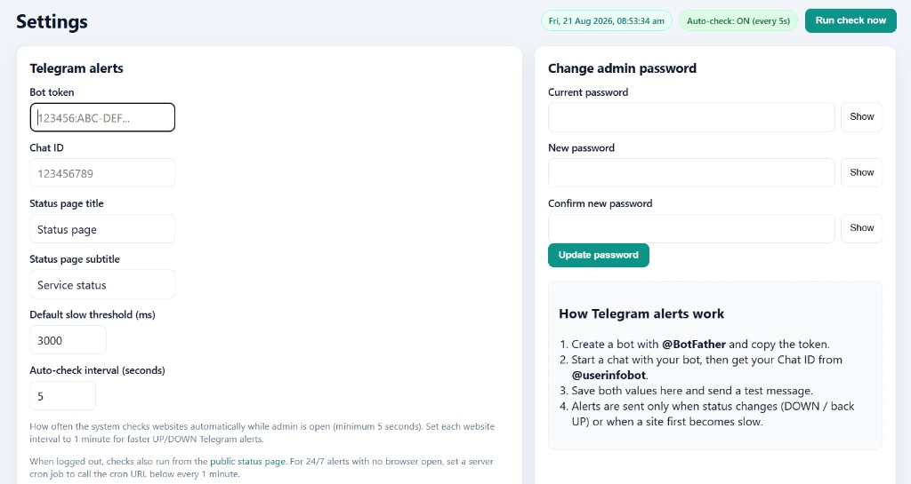
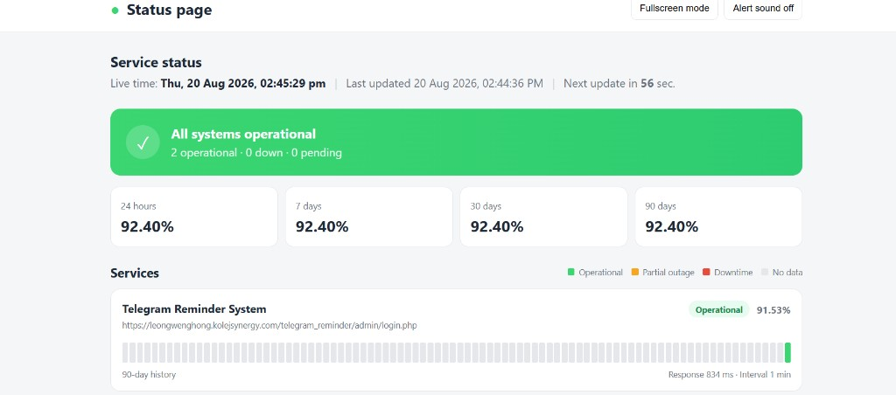

# Website Monitoring System with Telegram Alerts

Admin-only uptime monitor for XAMPP. Checks websites on a schedule, logs every result, sends Telegram alerts on status changes, and includes a public UptimeRobot-style status page.

## Quick start (XAMPP)

1. Place this project in `C:\xampp\htdocs\website_monitoring2`
2. Start **Apache** and **MySQL** in XAMPP
3. Open http://localhost/website_monitoring2/install.php
4. Use typical XAMPP database values:
   - Host: `localhost`
   - Database: `website_monitoring`
   - User: `root`
   - Password: *(empty, unless you changed it)*
5. Create your admin username and password (minimum 6 characters)
6. Save the **password reset key** and **cron key** shown after install
7. Log in and add a website (for example `https://www.google.com`)
8. Click **Run check now** on the dashboard, or set up cron below for automatic checks
9. In **Settings**, add your Telegram Bot Token and Chat ID to receive DOWN / recovery alerts

Forgot password: open **Forgot password?** on the login page. The reset key is shown at install time and again in **Settings**.

## Features

- Admin login only (session-based, hashed passwords, show/hide password)
- Add / edit / delete website monitors with custom check intervals
- HTTP uptime checks with response time and HTTP status code
- Green **UP** / Red **DOWN** status badges, with slow-response detection
- Dashboard with UP/DOWN counts, recent alerts, and latest checks
- Full monitoring logs and status-change history
- Telegram alerts only when status changes (no duplicate spam)
- Auto-check while admin panel is open, plus cron / Task Scheduler engine
- Search and filters (name, URL, status, today, last 7 days)
- Public status page with 90-day uptime bars — no login required

## Screenshots

| Login | Dashboard |
|:---:|:---:|
|  |  |

| Manage websites | Monitoring logs |
|:---:|:---:|
|  |  |

| Status changes | Alerts |
|:---:|:---:|
|  |  |

| Settings | Public status page |
|:---:|:---:|
|  |  |

## URLs

| Page | URL |
|---|---|
| Installer | http://localhost/website_monitoring2/install.php |
| Admin login | http://localhost/website_monitoring2/admin/login.php |
| Public status page | http://localhost/website_monitoring2/status/ |

> URLs follow your folder name in `htdocs`. If you rename the folder, update the paths above.

## Folder structure

```
website_monitoring2/
├── admin/                   Admin panel (dashboard, websites, logs, alerts, settings)
├── assets/css + js          Admin and status page UI
├── config/
│   ├── database.php         MySQL connection (created by installer)
│   └── telegram.php         Telegram config (synced from Settings)
├── cron/
│   ├── monitor.php          Monitoring engine
│   └── run-monitor.bat      Run one check from Windows Explorer
├── docs/screenshots/        README screenshots
├── includes/                Auth, Telegram, check logic, layout
├── sql/schema.sql           MySQL tables
├── status/index.php         Public status page
├── install.php              First-run web installer
└── index.php                Redirects to installer or login
```

## 1. XAMPP setup

1. Copy this folder to `C:\xampp\htdocs\website_monitoring2`
2. Start **Apache** and **MySQL** in XAMPP
3. Open http://localhost/website_monitoring2/install.php
4. Fill in database details and create the admin account
5. Telegram fields are optional during install — you can configure them later in **Settings**
6. Log in at http://localhost/website_monitoring2/admin/login.php

If the installer already ran, delete `install.lock` only when you intentionally want to reinstall.

### Manual database import (optional)

If you prefer phpMyAdmin instead of the installer:

1. Import `sql/schema.sql`
2. Edit `config/database.php` with your MySQL credentials
3. Insert an admin password hash and settings rows manually, then create `install.lock`

The installer is the easier path.

## 2. Add and manage websites

1. Log in and open **Websites** → **Add website**
2. Enter name, full URL (`https://example.com`), and check interval in minutes
3. Tick **Show this website on the public status page** if it should appear publicly
4. Click **Run check now** on the dashboard for an immediate result
5. Open the public status page to see the UptimeRobot-style view

Status meaning:

- **UP** — HTTP response received (typically 200–399)
- **DOWN** — timeout, connection error, or HTTP 400+
- **Slow** — still UP, but response time exceeds the threshold

## 3. Telegram bot setup

1. In Telegram, open [@BotFather](https://t.me/BotFather)
2. Send `/newbot` and follow the steps
3. Copy the **bot token**
4. Start a chat with your new bot and send any message (for example `hello`)
5. Open [@userinfobot](https://t.me/userinfobot) (or similar) and copy your numeric **Chat ID**
6. In Admin → **Settings**, paste Bot token and Chat ID, then save
7. Click **Send test Telegram message**

Alerts are sent only when:

- a website goes **DOWN**
- it comes back **UP**
- it first becomes **SLOW** (response time above the threshold)

No duplicate Telegram message is sent while the status stays the same.

Example alert:

```
🔴 ALERT: Website DOWN

Website: Example
URL: https://example.com
Status: DOWN
Response time: timeout / n/a
HTTP code: n/a
Time: 20 Aug 2026, 08:30:00 AM
```

## 4. Automatic monitoring

The engine checks each website only when its own interval has passed. Run the script **every 1 minute**.

While the admin panel is open, the app also auto-checks on a short interval (configurable in **Settings**, minimum 5 seconds).

### Windows (XAMPP) — Task Scheduler

1. Open **Task Scheduler** → Create Task → name it `WebsiteMonitoring`
2. Trigger: **Daily**, repeat every **1 minute**, for an unlimited duration
3. Action: Start a program
   - Program: `C:\xampp\php\php.exe`
   - Arguments: `C:\xampp\htdocs\website_monitoring2\cron\monitor.php`
4. Optional: run whether user is logged on or not, and **Run with highest privileges**

You can also double-click `cron\run-monitor.bat` to run one check from Explorer.

### Alternative: browser / wget URL

In **Settings**, copy the secret cron URL:

`http://localhost/website_monitoring2/cron/monitor.php?key=YOUR_CRON_KEY`

Keep that key private.

### Linux crontab

```
* * * * * php /path/to/website_monitoring2/cron/monitor.php
```

## 5. Public status page

The public page is modeled after [UptimeRobot status pages](https://stats.uptimerobot.com/rjqsmVv9qb):

- Overall banner: All systems operational / Partial outage / Major outage
- Last updated + countdown refresh
- Each service: operational/down badge, 90-day uptime bars, uptime percentage
- Overall uptime for 24 hours / 7 / 30 / 90 days
- Recent incidents from the last 7 days
- Fullscreen mode and optional alert sound

Only websites with **Show on status page** enabled appear here. No login is required.

## 6. Forgot password

On the login page, open **Forgot password?**. You need:

- Admin username
- Password reset key (shown after install, and again in **Settings**)

If you are locked out and still have server access, `admin/emergency_reset.php` exists as a last-resort option — delete that file after use.

## 7. System flow

1. Admin logs in
2. Admin adds websites with check intervals
3. Cron (or **Run check now**) hits each due website
4. Result is stored in `logs`
5. Current status is compared with the previous status
6. Telegram is notified only on a change
7. Dashboard, logs, alerts, and status page update

## 8. Database tables

- `admins` — admin account
- `websites` — monitors, current status, interval, last check
- `logs` — every check result
- `alerts` — DOWN / recovery / slow events
- `settings` — Telegram, status page title, cron key, reset key

## 9. Requirements

- PHP 7.4+ with **pdo_mysql** and **curl**
- MySQL / MariaDB (XAMPP default is fine)
- Apache (or any PHP web server)

If website checks fail with cURL errors, enable `extension=curl` in `C:\xampp\php\php.ini`, then restart Apache.

Default timezone is `Asia/Kuala_Lumpur` (configurable in **Settings**).

## Security notes

- Admin-only access — no public registration
- Passwords are hashed with `password_hash()`
- Sessions are used after login
- `config/` and `includes/` are blocked by `.htaccess`
- The cron script requires a secret key when opened in a browser
- Real credentials are gitignored: `config/database.php`, `config/telegram.php`, and `install.lock`
- Use `config/database.example.php` and `config/telegram.example.php` as templates

To reinstall: delete `install.lock`, drop the `website_monitoring` database in phpMyAdmin, then open the installer again.

## License

This project is licensed under the [MIT License](LICENSE).
